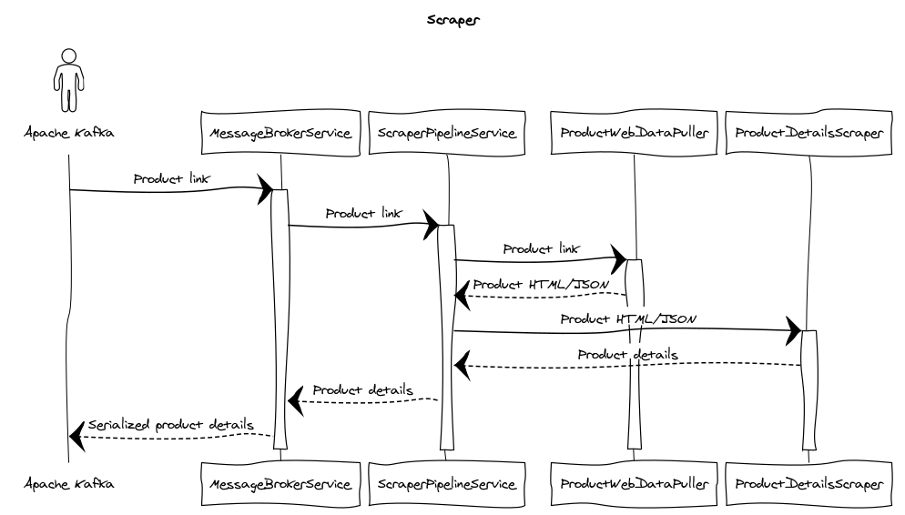

# Scraper

Приложение, отвечающее за получение полезных данных о товаре (таких, как, например, название товара, цена на товар и т.
д.) по ссылке на этот товар на маркетплейсе.

Диаграмма последовательности выглядит следующим образом


1. Ссылка на товар приходит из брокера сообщений и попадает в метод `consume` класса `MessageBrokerService`.
2. Далее запускается процесс обработки этой ссылки, за который отвечает класс `ScraperPipelineService`.
3. Сперва ссылка передается методу `get_web_data` класса `ProductWebDataPuller`, который по ссылке на товар получает от
   маркетплейса сырые данные об этом товаре в формате HTML или JSON.
4. Далее полученные данные передаются в метод `get_details` класса `ProductDetailsScraper`, который из сырых данных
   получает полезную информацию о товаре.
5. Эти полезные данные, сериализованные в JSON, передаются методом `__produce` класса `MessageBrokerService` через
   брокер сообщений в другое приложение.

## Использование

Для запуска приложения вручную нужно, находясь в корневой директории проекта, выполнить следующие шаги:

1. Создать виртуальное окружение:

```shell
python3 -m venv .venv
```

2. Активировать виртуальное окружение:

```shell
source .venv/bin/activate
```

3. Установить все необходимые для работы проекта зависимости:

```shell
pip install -r requirements.txt
```

4. Установить переменную окружения `PYTHONPATH`, которая используется для определения, где искать модули при импорте:

```shell
export PYTHONPATH=.:$PYTHONPATH
```

5. Теперь можно запускать само приложение:

```shell
python3 scraper/main.py
```
